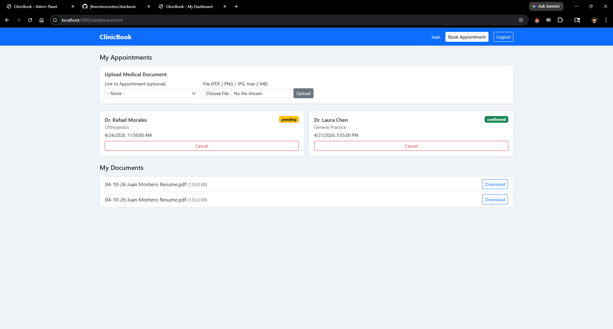
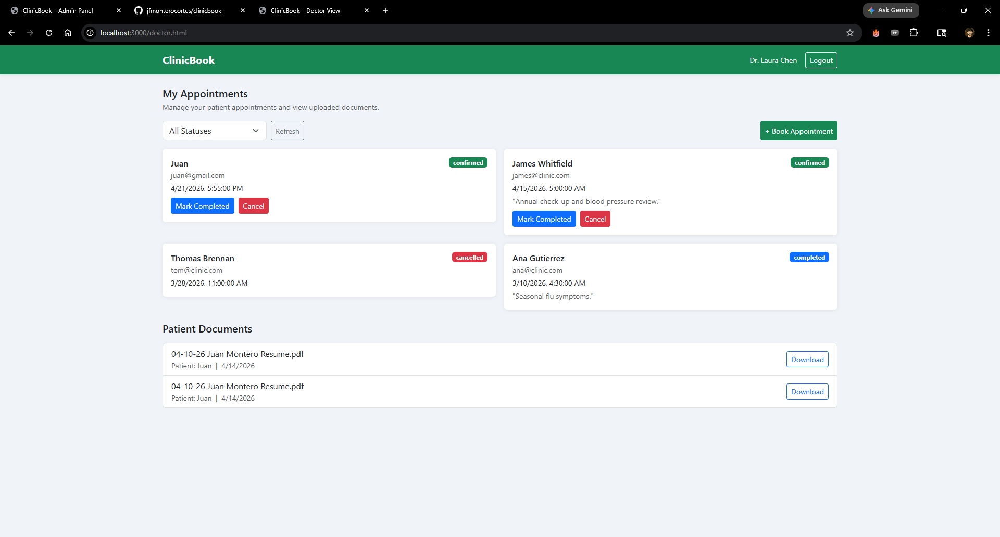
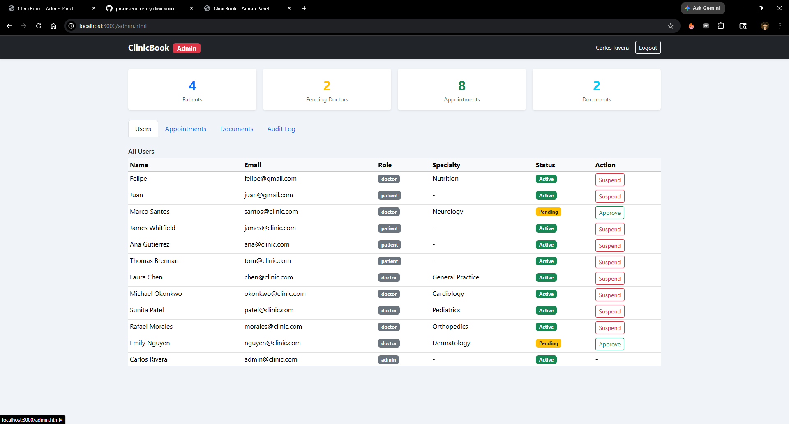
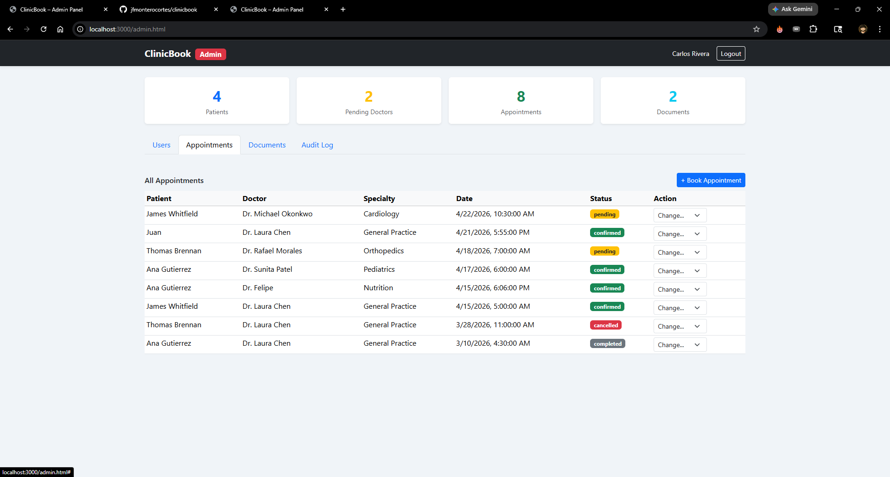
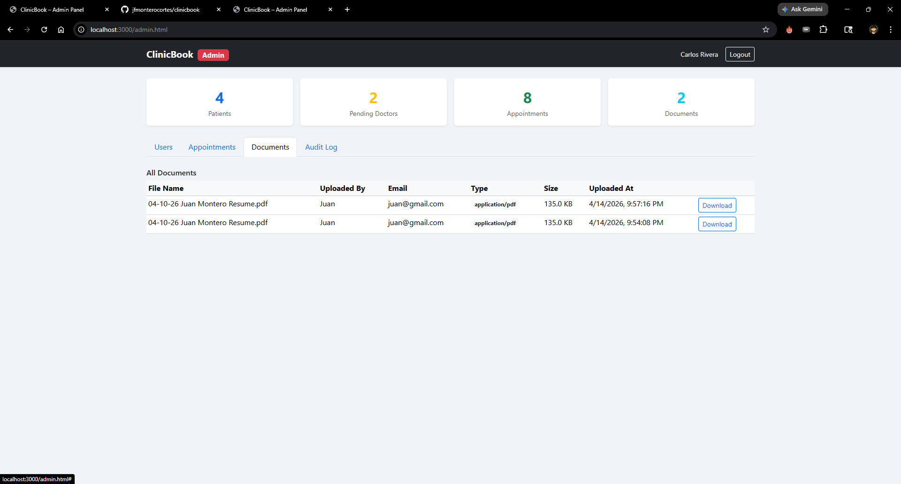
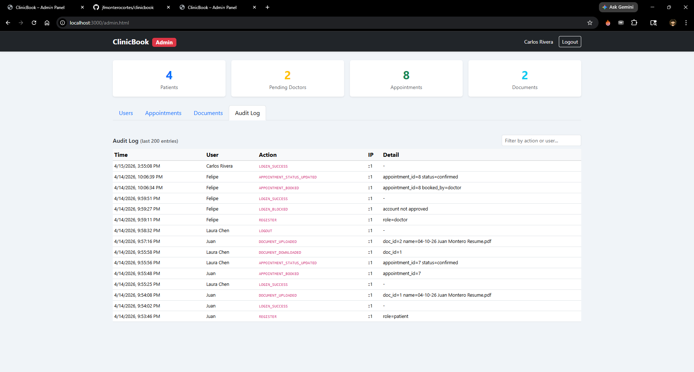

# ClinicBook – Secure Clinic Booking System

A secure client-server web application for booking clinic appointments, built for a course project on application security.

## Tech Stack

- **Frontend:** HTML5, Bootstrap 5, Vanilla JavaScript
- **Backend:** Node.js, Express
- **Database:** SQLite (via `better-sqlite3`)
- **Security:** `helmet`, `bcrypt`, `cookie-session`, `express-rate-limit`, `express-validator`, `multer`, `file-type`

## Setup

### Prerequisites
- Node.js v18+ installed

### Installation

```bash
# 1. Install dependencies
npm install

# 2. Copy environment file and set a session secret
cp .env.example .env
# Edit .env and change SESSION_SECRET to a long random string

# 3. Seed demo data (creates DB + demo accounts)
npm run seed

# 4. Start the server
npm start
```

The app will be available at **http://localhost:3000**

## Demo Accounts

> These credentials exist only in the seeded demo database and are listed here for evaluation purposes. In a real deployment the seeder would not be used; all accounts would be created through the registration flow with strong, unique passwords.


| Role            | Email               | Password       |
|-----------------|---------------------|----------------|
| Admin           | admin@clinic.com    | Admin#2026     |
| Doctor          | chen@clinic.com     | Doctor#2026    |
| Doctor          | okonkwo@clinic.com  | Doctor#2026    |
| Doctor          | patel@clinic.com    | Doctor#2026    |
| Doctor          | morales@clinic.com  | Doctor#2026    |
| Doctor (pending)| nguyen@clinic.com   | Doctor#2026    |
| Doctor (pending)| santos@clinic.com   | Doctor#2026    |
| Patient         | james@clinic.com    | Patient#2026   |
| Patient         | ana@clinic.com      | Patient#2026   |
| Patient         | tom@clinic.com      | Patient#2026   |

## Screenshots

| Patient Dashboard | Doctor Dashboard |
|---|---|
|  |  |

| Admin - Users | Admin - Appointments |
|---|---|
|  |  |

| Admin - Documents | Admin - Audit Log |
|---|---|
|  |  |

## Features

### Patient
- Register / log in
- Search doctors by name and specialty
- Book appointments
- Upload medical documents (PDF/PNG/JPG, max 2 MB)
- View and cancel their appointments

### Doctor
- Log in (account requires admin approval)
- View and manage their appointments (confirm, complete, cancel)
- Download patient-uploaded documents linked to their appointments

### Admin
- Approve or suspend doctor accounts
- View and update status of all appointments
- View all uploaded documents
- View and filter audit log
- Dashboard stats (patients, pending doctors, appointments, documents)

## Security Highlights

| Control | Implementation |
|---|---|
| Password hashing | bcrypt (cost 12) |
| Session security | `httpOnly`, `sameSite=lax`, signed cookie session, cleared on login |
| SQL injection | Prepared statements only (no string concatenation) |
| Input validation | `express-validator` on all endpoints |
| File upload safety | MIME + extension whitelist, 2 MB limit, UUID filenames, stored outside `public/` |
| Rate limiting | 10 auth requests / 15 min per IP |
| Security headers | `helmet` (CSP, HSTS, X-Frame-Options, etc.) |
| Access control | Role middleware + per-resource ownership checks |
| Audit logging | All sensitive actions logged to `audit_logs` table with IP and user agent |
| Error handling | No stack traces exposed to the client |

## Project Structure

```
GroupProject_Application/
├── public/          # Front-end (HTML pages + JS)
├── src/
│   ├── server.js    # Express app entry point
│   ├── db.js        # Database connection
│   ├── routes/      # API route handlers
│   └── middleware/  # Auth, validation, rate limit, audit
├── db/
│   └── schema.sql   # Database schema
├── uploads/         # Uploaded files (gitignored)
├── docs/            # Proposal and report PDFs
├── seed.js          # Demo data seeder
└── .env.example     # Environment variable template
```

## OWASP Coverage

- **A01 Broken Access Control** — role-based middleware, ownership checks
- **A02 Cryptographic Failures** — bcrypt, secure cookies, secrets in `.env`
- **A03 Injection** — parameterized queries, input validation
- **A05 Security Misconfiguration** — helmet headers, no default credentials, errors sanitized
- **A07 Authentication Failures** — rate limiting, session fixation prevention, strong password policy
- **A09 Logging & Monitoring** — `audit_logs` table with full action trail
